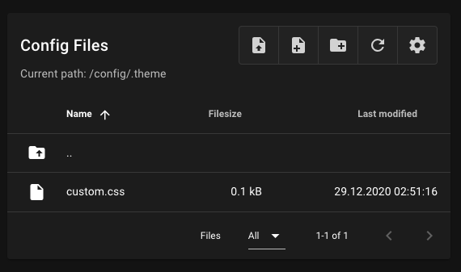
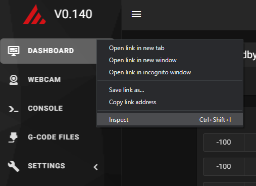
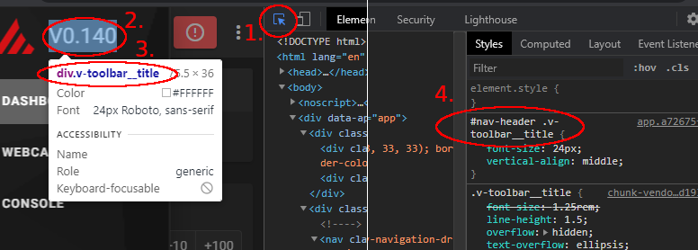
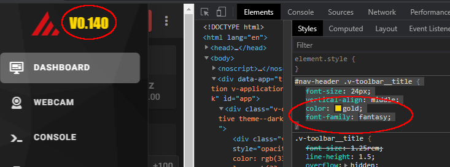
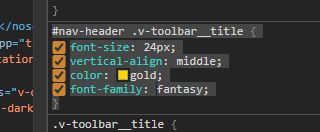
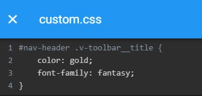

# Custom CSS

The `custom.css` file allows you to customize the appearance of Mainsail without the need of rebuilding it. Place a file named `custom.css` in the `.theme` folder of your Mainsail installation and define your custom Cascading Style Sheets (CSS) rules inside the file.

## Customizing the CSS 

You need to be familiar with the CSS syntax to customize Mainsail. There are many resources available to learn CSS online, for example: [W3Schools - CSS tutorial](https://www.w3schools.com/css/default.asp)

### &#x20;Finding the Element to Customize 

You will need to use your browser’s built in developer tools to find the element you want to customize. You can do this by clicking the “Developer Tools” button in the browser’s toolbar or by right clicking on the page and choosing `Inspect Element` or press `F12`.

1. Activate the developer tools and inspector
2. Select the desired element
3. Find the selector
4. Use the style editor to customize the element. Play around to find the style you like!

When you have achieved your desired appearance, copy the full “section”, including the selector and curly braces.

Next copy it inside the “custom.css” file (you can keep everything or only what you have added)


NOTE: After saving, your browser may need a uncached reload to show the change. Visit [Wikipedia to learn how.](https://en.wikipedia.org/wiki/Wikipedia:Bypass\_your\_cache#Bypassing\_cache)

