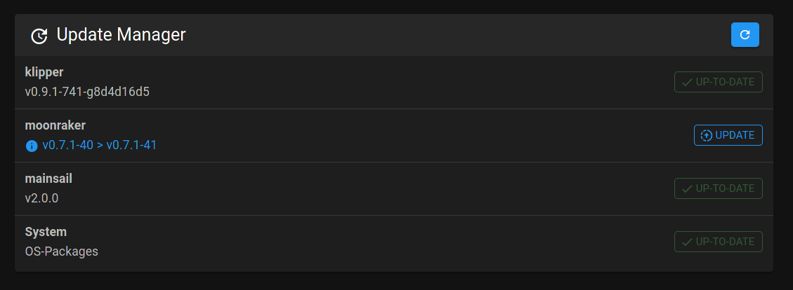

# Update Manager



## Enabling the Update Manager <a href="#enabling-update-manager" id="enabling-update-manager"></a>


MainsailOS does not require this step to be performed.


The Update Manager has to be enabled in Moonraker. To do this, select "Machine" in the navigation bar.

In case you already see the "Update Manager" panel with Mainsail in it you can skip this step, otherwise open the `moonraker.conf` in the file manager.

Add the following sections, if not already present:


```yaml
[update_manager]
refresh_interval: 168
enable_auto_refresh: True

[update_manager client mainsail]
type: web
channel: stable
repo: mainsail-crew/mainsail
path: ~/mainsail
```


After that you have to **restart the Moonraker service**. This can be done via the power menu in the upper right corner.


You can find further information on this topic in the [Moonraker documentation](https://github.com/Arksine/moonraker/blob/master/docs/configuration.md#update\_manager).


## Updates <a href="#using-mainsail-to-update" id="using-mainsail-to-update"></a>

With Update Manager enabled, select the "Machine" tab in the sidebar. The "Update Manager" panel will be present.

### Check for updates

You should click the reload button to have Moonraker check for recent updates. Moonraker also checks for updates periodically, but the standard interval is set quite high, although that can be configured. In the config above, we have already decreased the value to 7 days (168 hours).

### Check release notes

Review the release notes by clicking on the info icon next to the component.


Please note that some Klipper updates **may require a reflash of the MCUs**. Without reflashing, your printer will not work. Avoid updating when you have important prints pending.


### Perform updates


The recommended order of updating is from top to bottom.


To update a component, click the "Update/Upgrade" button next to the component you want to update. Alternatively, you can select the "Update all components" button.

Several details about the update process are displayed in a pop-up window. Once the update is complete, you can close this window.

### States

The components in the Update Manager can have different statuses.


#### <mark style="color:green;">**UP-TO-DATE**</mark>

Everything is fine and up to date.

#### <mark style="color:blue;">**UPDATE / UPGRADE**</mark>

Updates are available for the component. Upgrades are for system packages.

#### <mark style="color:orange;">**DETACHED**</mark>

The components <mark style="color:orange;">****</mark> repo is currently in a detached state. You can recover the status.

#### <mark style="color:orange;">**DIRTY**</mark>

Files of the components repo were modified. If this happened unintentionally, you can recover the status.

#### <mark style="color:red;">**INVALID**</mark>

The configured file path is not available. Check if the component is installed properly and the path in moonraker.conf is correct.

