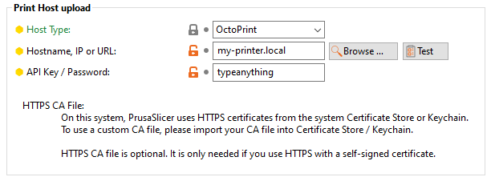
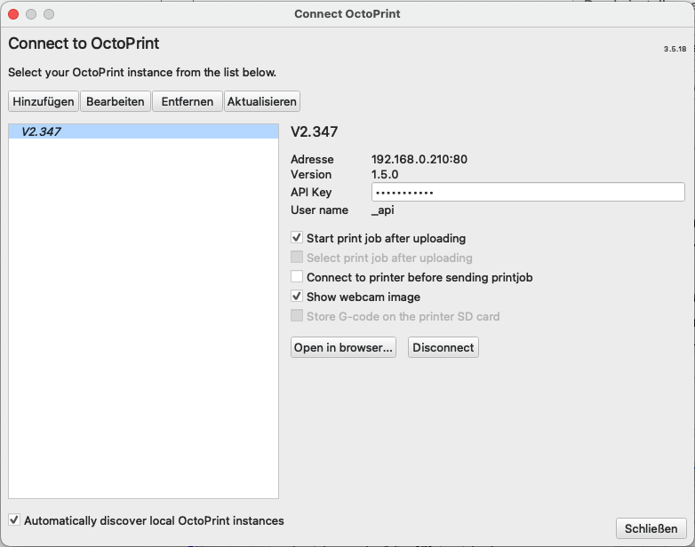

# Slicer upload

Moonraker is compatible with OctoPrint’s API. To enable OctoPrint API compatibility, add the following to your `moonraker.conf` and restart Moonraker.

```
[octoprint_compat]
```

## PrusaSlicer / SuperSlicer (PrusaSlicer v2.3.0 and up) <a href="#prusaslicer--superslicer-prusaslicer-v230-and-up" id="prusaslicer--superslicer-prusaslicer-v230-and-up"></a>

Enable advanced or expert mode and change the options under `Printer Settings / General` as shown in the screenshot below. A “Physical Printer” must be configured in `Printer Settings / General`.

## PrusaSlicer / SuperSlicer (prior to PrusaSlicer v2.3.0) <a href="#prusaslicer--superslicer-prior-to-prusaslicer-v230" id="prusaslicer--superslicer-prior-to-prusaslicer-v230"></a>

Enable advanced or expert mode and change the options under `Printer Settings / General` as shown in the screenshot below. For “API Key” you can type anything.



## Cura with OctoPrint-Connect <a href="#cura-with-octoprint-connect" id="cura-with-octoprint-connect"></a>

Install the OctoPrint-Connection plugin in Cura’s Marketplace. In Cura go to `Settings > Printer > Manage Printers` and find the Button `Connect OctoPrint`. Add your printer and type anything in the `API Key` field.


