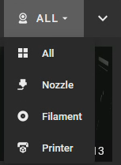

# Webcams

## Prerequisites

### MJPEG

To be able to add a stream to Mainsail, it must be available as a so-called “MJPEG stream”.

So either you have a network camera that offers such a stream by itself, or you use a conventional webcam (USB camera, Raspberry Pi Camera, …) that is connected to your system. For a non-network cameras, you need to install and configure a streamer software on your system, such as [Crowsnest](http://127.0.0.1:5000/o/O2j4rN2JOaGEeS1KBjXz/s/qXE1OQLsr0XFNbT54RTY/).&#x20;


[MainsailOS ](http://127.0.0.1:5000/o/O2j4rN2JOaGEeS1KBjXz/s/HZGYoL7ogomNyBLNEpEJ/)comes preinstalled with [Crowsnest](http://127.0.0.1:5000/o/O2j4rN2JOaGEeS1KBjXz/s/qXE1OQLsr0XFNbT54RTY/) as streamer. If you wish to install Crowsnest on your system, or need assistance in configuring Crowsnest, please refer to its documentation.


Once such a stream is available, you only have to configure it in the Mainsail settings.&#x20;

### IP Cam

The stream of your IP camera needs to be compatible with your browser. More information:

[https://developer.mozilla.org/en-US/docs/Web/HTML/Element/video](https://developer.mozilla.org/en-US/docs/Web/HTML/Element/video)\
[https://www.w3schools.com/tags/tag\_video.asp](https://www.w3schools.com/tags/tag\_video.asp)

## Settings

Go to the [settings](./) and select the Webcam category.

In this view, you can add new webcams, or edit and remove existing ones.

While adding or editing a webcam, you will see the following screen.

\[Insert Image....]

### Preview

On the right side, you can check the settings in a preview.

### Name and Icon

At first, you have to give the camera a name, and you can assign an icon to it.

### Streaming URLs

You also need to specify stream and snapshot URL. For network cameras, please consult the manufacturer's manual or search the Internet.

**Note:** In [MainsailOS](http://127.0.0.1:5000/o/O2j4rN2JOaGEeS1KBjXz/s/HZGYoL7ogomNyBLNEpEJ/), by default, four webcam ports are mapped to URLs. Notice that the first URL doesn't contain a number. Check which port you have configured in your streamer and add the URLs.

<table><thead><tr><th width="150">Port</th><th>Stream URL</th><th>Snapshot URL</th></tr></thead><tbody><tr><td>8080</td><td>/webcam/?action=stream</td><td>/webcam/?action=snapshot</td></tr><tr><td>8081</td><td>/webcam2/?action=stream</td><td>/webcam2/?action=snapshot</td></tr><tr><td>8082</td><td>/webcam3/?action=stream</td><td>/webcam3/?action=snapshot</td></tr><tr><td>8083</td><td>/webcam4/?action=stream</td><td>/webcam4/?action=snapshot</td></tr></tbody></table>

### Streaming mode

You also need to select a streaming mode. Below are descriptions of the different modes, so you can decide. Try out what works best for you.

<table><thead><tr><th width="213.55085622344592">Mode</th><th>Description</th></tr></thead><tbody><tr><td><strong>MJPEG-Streamer</strong></td><td>
The streamer mode extracts individual frames from the stream URL and streams them. 

This is to prevent the buildup of delay in case of insufficient bandwidth.   <strong>IMPORTANT:</strong> This mode does currently not work on iOS devices for technical reasons.
</td></tr><tr><td><strong>Adaptive MJPEG-Streamer</strong></td><td>
The adaptive mode takes the snapshot URL and pulls individual images. 

Also, this is intended to prevent a delay.
</td></tr><tr><td><strong>UV4L-MJPEG</strong></td><td>
The classic mode is the plain MJPEG stream embedded in an image tag. 

In this case, it can happen that after some runtime a delay steadily builds up, because frames cannot be skipped. Only a browser reload will help.
</td></tr><tr><td><strong>IP-Camera</strong></td><td>The stream URL is embedded in an HTML5 video element. We can't really provide support for this. Browser plugins may be required.</td></tr><tr><td><strong>WebRTC (camera-streamer)</strong></td><td>This stream is very bandwidth efficient.  <strong>IMPORTANT</strong>: This mode is currently only available on Raspberry devices.</td></tr><tr><td><strong>HLS Streamer</strong></td><td>This mode is for IP webcams with RTSP support.</td></tr></tbody></table>

### Target FPS

Only in adaptive MJPEG mode, you also have to set the target frame rate. This is how often per second an image is requested.

### Image Settings

Flip the webcam vertically and/or horizontally. Both at the same time corresponds to a 180° rotation.
